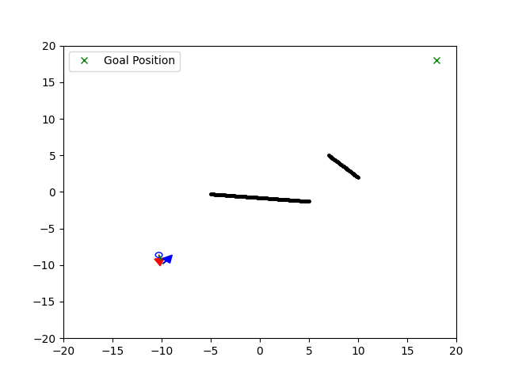

# HRI_RL
## Playing with RL to enable cooperative transportation between robot and humans

## About The Project

This project is a aimed at learning a RL policy to enable cooperative transportation between robot and Human in a 2D Environement implementation. To simulate the motion of Human agent this project used [PySocialForce](#pysocialforce), and stablebaseline3 PPO model is used to train and learn this policy. The Robot is modelled as a 2 Wheeled diff drive robot, the actions are the induvidual wheel velocity of the robot.

### Roadmap

- [x] Simulation of indiviual Agents
- [x] Adding Obstacles to the env
- [x] Setting up Training and Testing scripts
- [x] Formulating some basic rewards functions
- [ ] Better environment representation
- [ ] Easy configuration with toml file
- [x] Visualization of indiviuals and groups
- [ ] Visualization of forces/potentials

## Installation

1. Clone the repo

    ```sh
    git clone https://github.com/srirampr22/HRI_RL.git
    ```

2. (optional) Create a python virtual environment and activate it
<!-- 3. Install the pip package

    ```sh
        # Option 1: install from PyPI
        pip install 'pysocialforce[test,plot]'

        # Option 2:  install from source
        pip install -e '.[test,plot]'

        # run linting and tests
        pylint pysocialforce
        pytest tests/*.py
    ``` -->

## Usage

Basic usage:

To run training:
'''python3 train.py'''

## Configuration
You can configure the parameters  for the Human by passing in a [toml](https://github.com/toml-lang/toml) file to the simulator in Human_SF.py:
```Python
sim = psf.Simulator(
        initial_state, groups=groups, obstacles=obstacles, config_file="user_config.toml"
    )
```


## Examples

### Ped-ped Scenarios

|           |  |
| ----------------------------------------- | ------------------------------------- |
|  |     |


