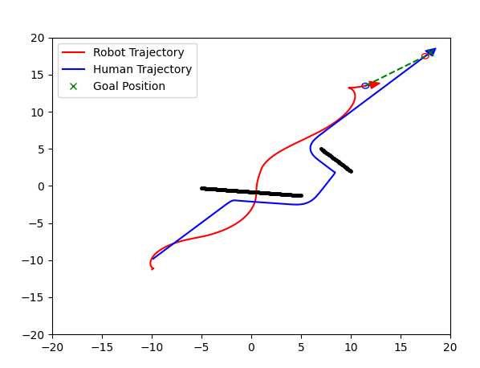
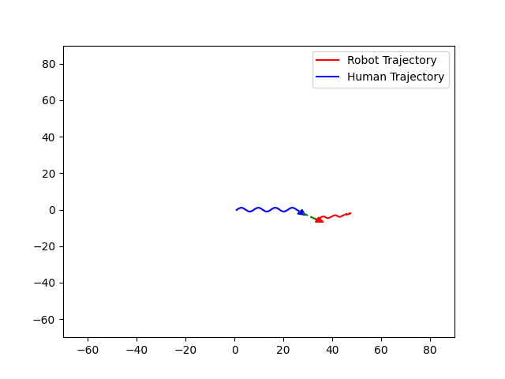
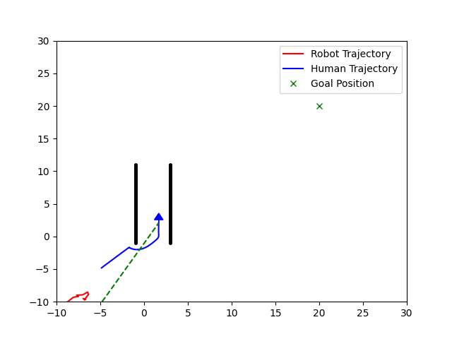
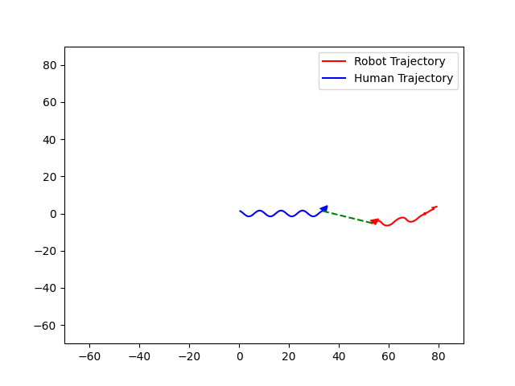

# HRI_RL
## Playing with RL to enable cooperative transportation between robot and humans

## About The Project

This project is a aimed at learning a RL policy to enable cooperative transportation between robot and Human in a 2D Environement implementation. To simulate the motion of Human agent this project used [PySocialForce](#pysocialforce), and stablebaseline3 PPO model is used to train and learn this policy. The Robot is modelled as a 2 Wheeled diff drive robot, the actions are the induvidual wheel velocity of the robot.

### Roadmap

- [x] Simulation of indiviual Agents
- [x] Basic Env setup 
- [x] Adding Obstacles to the env
- [x] Setting up Training and Testing scripts
- [x] Formulating some basic rewards functions
- [ ] Better environment representation
- [ ] Better observation state
- [ ] Easy configuration with toml file
- [x] Visualization of indiviuals and groups
- [ ] Visualization of forces/potentials

For Now, the primary objective is to develop a robust translation function for determining the nexr best action to take  for the robot (left and right wheel velocity) based on the current obseravtion (state). The problem here is to control the robot effectively such that it maintains a certain distance and orientation with the human till the human reaches a certain goal postion. For now i have decied to go ahed with PPO (Proximal Policy Optimization) since it is well-suited for the task of controlling a robot to follow a human while maintaining a desired distance. Here's why i have chose PPO, these reasons can also motivate me in the future to pursure better architectures.


1. Continuous Action Space: PPO handles continuous action spaces well, which is crucial for smooth robot control.
2. Sample Efficiency: it is more sample-efficient than many other RL algorithms.
3. Stability:It uses a "trust region" approach that prevents large policy updates, reducing the risk of catastrophic forgetting or performance collapse.
4. Robustness: The clipped objective function in PPO helps prevent excessively large policy updates.
5. Parallel Implementation: PPO can be easily parallelized, allowing for faster training if you have multiple CPU cores or environments.
6. Handling Complex Reward Structures: The task involves balancing multiple objectives (maintaining distance, matching velocity, avoiding collisions).


<!-- 
Good Performance on Continuous Control Tasks:

PPO has shown good performance on various continuous control tasks, including robotics simulations.


Easier Hyperparameter Tuning:

Compared to some other algorithms, PPO often requires less hyperparameter tuning to achieve good performance.


Ability to Learn Time-Dependent Policies:

If the human's movement patterns have time-dependent aspects, PPO can learn policies that account for these temporal dynamics.


Balance Between Exploration and Exploitation:

PPO maintains a good balance between exploring new behaviors and exploiting known good behaviors, which is crucial for adapting to human movement. -->


While PPO is well-suited for this task, it's worth noting that other algorithms like SAC (Soft Actor-Critic) or TD3 (Twin Delayed Deep Deterministic Policy Gradient) could also be effective. Which will be further explored in the future.

Action Space: action space is designed to control the wheel velocities of a differential drive robot (v_left, v_right), and it is normalized to a range of [−1,1]. 

The differential drive robot has two wheels, each of which can be controlled independently. The robot's movement is determined by the velocities of these wheels.


Observation Space (State space): Observation space defines the state which includes robot_pose(x,y,theta), robot_vel(vx,vy), dist_to_human, dist_to_nearest_obs_point and human_robot_orientation diffrence.

Rewards:

1. Distance from Human
2. Collision
3. Velocity


## Installation

1. Clone the repo

    ```sh
    git clone https://github.com/srirampr22/HRI_RL.git
    ```

2. (optional) Create a python virtual environment and activate it
<!-- 3. Install the pip package

    ```sh
        # Option 1: install from PyPI
        pip install 'pysocialforce[test,plot]'

        # Option 2:  install from source
        pip install -e '.[test,plot]'

        # run linting and tests
        pylint pysocialforce
        pytest tests/*.py
    ``` -->

## Usage

Basic usage:

To run training:
```Python
    python3 train.py --learning_rate=0.0003
```
To run testing:
```Python
    python3 test.py --path_to_model="/path/to/where/the/model/is/saved/"
```
To test env setup:
```Python
    python3 train_env.py
```
## Configuration
You can configure the parameters  for the Human by passing in a [toml](https://github.com/toml-lang/toml) file to the simulator in Human_SF.py:
```Python
sim = psf.Simulator(
        initial_state, groups=groups, obstacles=obstacles, config_file="user_config.toml"
    )
```


## Examples

|   |  |
| ----------------------------------------- | ------------------------------------- |
|  |     |


